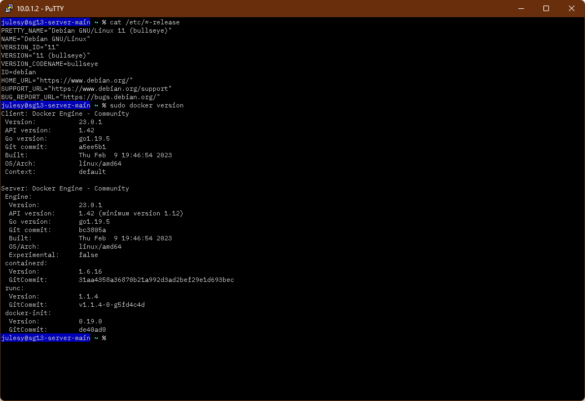

# Toxic Tweets
Developing a Language Model to classify toxic 🤢 tweets using HugginFace, Streamlit and GitHub.

Jules Blount
31430956

# Project Milestone 1
To begin I should mention I already have a home server with docker already installed with multiple containers running.
The tutorial I followed to install docker on my server is located [Here](https://docs.docker.com/engine/install/debian/)

*Docker runtime environment verification*:

Python prompt from Python container:

